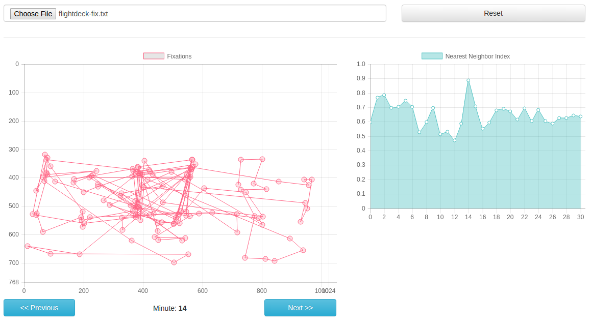

# ASTEF Project WebApp



This is the web-based version of the ASTEF Project application. Written in Javascript, the app uses the following technologies:

* VueJS;
* Babel;
* Webpack;
* MathJS;
* ChartJS;
* D3-Polygon;
* Vue-Strap;
* Mocha/Chai;

## Prerequistes

To use the application on your machine, you will need:

* NodeJS (>= 4.4.*)
* NPM (>= 2.15.*)

## Installation

1. `git clone` the repository (let's assume that you have chosen `astef` as directory name);
2. type `cd astef/src/webapp`;
3. type `npm install` in this directory;
4. compile assets by running `node_modules/.bin/webpack`;
5. open the `index.html` page (no local web server needed!);
6. You're done!

## Usage

To use the web application, you must upload a new valid fixations file.

This file will be in the following format:

```
1024 768                // resolution
1083 369 482            // single fixation (timestamp, x, y)
1684 388 546
1856 359 589
2264 337 684
3212 340 854
3576 380 433
```

Any other file/format will be not considered. After choosing the file, wait a couple of seconds.

After the processing procedure, you will see two separate charts:

* one, on the left, for the minute detail. Every fixation for the chosen minute will be displayed here;
* the other, on the right, for the history of the NNI values;

You will be able to change the minute by clicking on the "Next" and "Previous" buttons, or on a specific minute on the NNI values chart.

Have fun!

## Testing

We prepared some tests for the `NearestNeighborIndexProcessor`. You can run them by executing, once you've installed, everything:

```bash
$ node_modules/.bin/mocha --compilers js:babel-core/register
```
